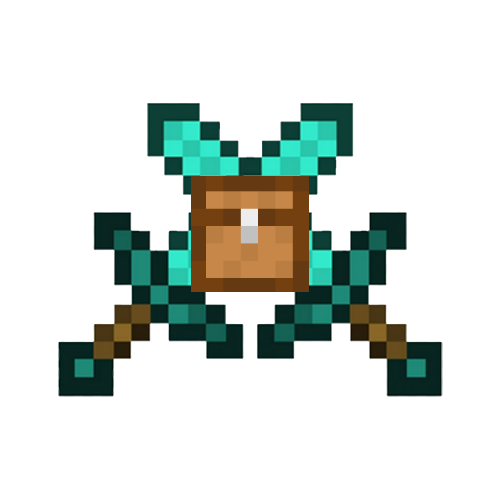

# Kits

Permissions-based player kits for Fabric Servers.

[][releases]
[][modrinth:files]

[![Modrinth Downloads](https://img.shields.io/badge/dynamic/json?color=5da545&label=modrinth&query=downloads&url=https://api.modrinth.com/api/v1/mod/kits&style=for-the-badge&logo=data:image/svg+xml;base64,PHN2ZyB4bWxucz0iaHR0cDovL3d3dy53My5vcmcvMjAwMC9zdmciIHZpZXdCb3g9IjAgMCAxMSAxMSIgd2lkdGg9IjE0LjY2NyIgaGVpZ2h0PSIxNC42NjciICB4bWxuczp2PSJodHRwczovL3ZlY3RhLmlvL25hbm8iPjxkZWZzPjxjbGlwUGF0aCBpZD0iQSI+PHBhdGggZD0iTTAgMGgxMXYxMUgweiIvPjwvY2xpcFBhdGg+PC9kZWZzPjxnIGNsaXAtcGF0aD0idXJsKCNBKSI+PHBhdGggZD0iTTEuMzA5IDcuODU3YTQuNjQgNC42NCAwIDAgMS0uNDYxLTEuMDYzSDBDLjU5MSA5LjIwNiAyLjc5NiAxMSA1LjQyMiAxMWMxLjk4MSAwIDMuNzIyLTEuMDIgNC43MTEtMi41NTZoMGwtLjc1LS4zNDVjLS44NTQgMS4yNjEtMi4zMSAyLjA5Mi0zLjk2MSAyLjA5MmE0Ljc4IDQuNzggMCAwIDEtMy4wMDUtMS4wNTVsMS44MDktMS40NzQuOTg0Ljg0NyAxLjkwNS0xLjAwM0w4LjE3NCA1LjgybC0uMzg0LS43ODYtMS4xMTYuNjM1LS41MTYuNjk0LS42MjYuMjM2LS44NzMtLjM4N2gwbC0uMjEzLS45MS4zNTUtLjU2Ljc4Ny0uMzcuODQ1LS45NTktLjcwMi0uNTEtMS44NzQuNzEzLTEuMzYyIDEuNjUxLjY0NSAxLjA5OC0xLjgzMSAxLjQ5MnptOS42MTQtMS40NEE1LjQ0IDUuNDQgMCAwIDAgMTEgNS41QzExIDIuNDY0IDguNTAxIDAgNS40MjIgMCAyLjc5NiAwIC41OTEgMS43OTQgMCA0LjIwNmguODQ4QzEuNDE5IDIuMjQ1IDMuMjUyLjgwOSA1LjQyMi44MDljMi42MjYgMCA0Ljc1OCAyLjEwMiA0Ljc1OCA0LjY5MSAwIC4xOS0uMDEyLjM3Ni0uMDM0LjU2bC43NzcuMzU3aDB6IiBmaWxsLXJ1bGU9ImV2ZW5vZGQiIGZpbGw9IiM1ZGE0MjYiLz48L2c+PC9zdmc+)][modrinth:files]
[][curseforge:files]
[][releases]

Kits is a **Minecraft mod** for [Fabric][fabric] servers that adds configurable,
permissions-based player kits. This allows server owners to easily set up
batches of items that their players can claim, depending on their rank.
Additionally, kits can have a predefined cooldown, so that players do not get to
use them infinitely.

**Compatible with LuckPerms**

## Usage

### Adding Kits

Command: `/kit add <kit_name> <cooldown_milliseconds>`\
Requires Permission: `kits.manage`

To add a kit, simply place the items you would like to be included in this kit
anywhere in your inventory and run the command `/kit add`.

### Claiming Kits

Command: `/kit claim <kit_name>`\
Requires Permission: `kits.claim.<kit_name>`

For players, claiming kits is simple. They simply type `/kit claim <kit_name>`.
If they have permissions to use the specified kit, and that kit is not on
cooldown for them, they receive the kit in their inventory (or on the ground if
their inventory is full.)

Brigadier suggestions are enabled, and will only suggest kits the player has
permissions for.

### Removing Kits

Command: `/kit remove <kit_name>`\
Requires Permission: `kits.manage`

To remove a kit, simply type `/kit remove <kit_name>`. This *irreversibly and
completely* **deletes** the specified kit from the server, for all users.

## Advanced

### Files

If, for whatever reason, you wish to configure kits manually, instead of using
the built-in commands, you can do so by modifying the kit files directly.

Kit files are stored in the directory `config/kits` in Minecraft's NBT format.
You can modify and create such files with a tool like [NBTExplorer](nbtexp).

This allows you to modify kit contents or cooldowns after creation, or even add
entirely new kits.

---

## Contributing

Thank you for considering contributing to Kits! Please see the
[Contribution Guidelines][contributing].

## Licence

Kits is open-sourced software licenced under the [MIT license][licence].

## Discord

Questions? Contact me in [my Discord server][discord].

[nbtexp]: https://github.com/jaquadro/NBTExplorer
[contributing]: .github/CONTRIBUTING.md
[curseforge]: https://curseforge.com/minecraft/mc-mods/kits
[curseforge:files]: https://www.curseforge.com/minecraft/mc-mods/kits/files/all
[modrinth:files]: https://modrinth.com/mod/kits/versions
[fabric]: https://fabricmc.net/
[licence]: LICENSE
[minecraft]: https://minecraft.net/
[releases]: https://github.com/John-Paul-R/kits/releases
[security]: .github/SECURITY.md
[discord]: https://discord.jpcode.dev/
